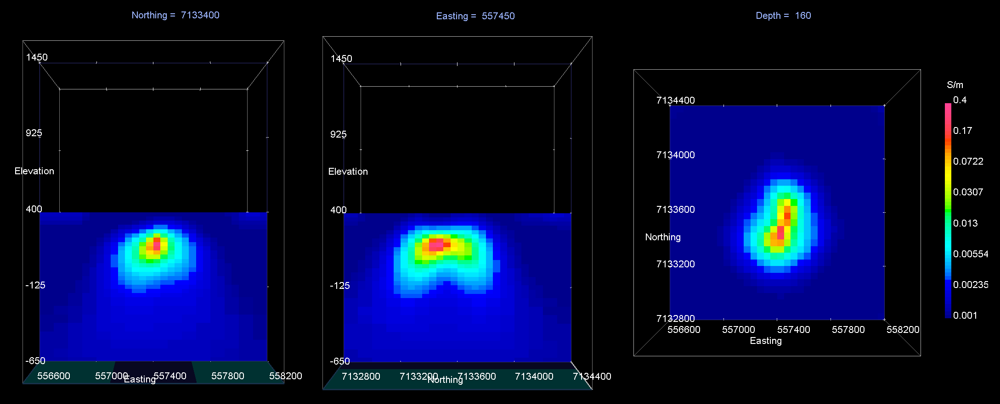
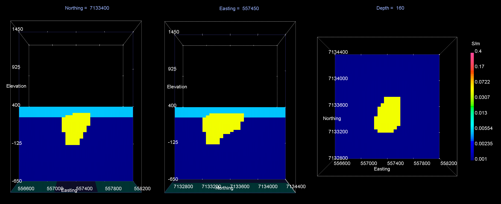
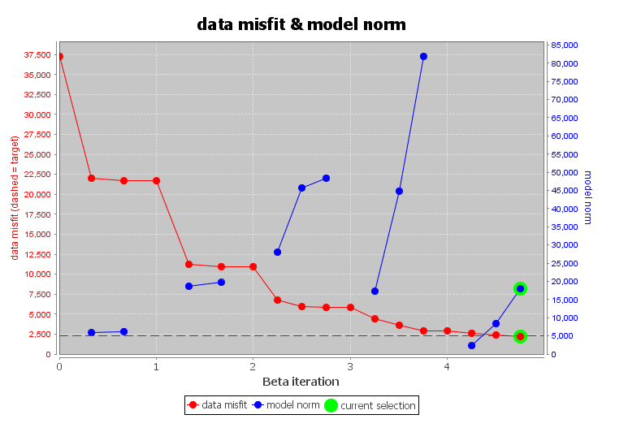
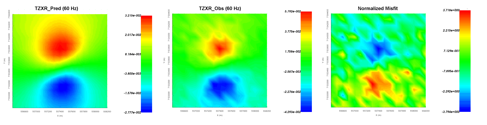
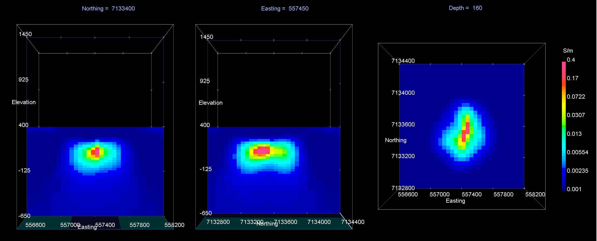
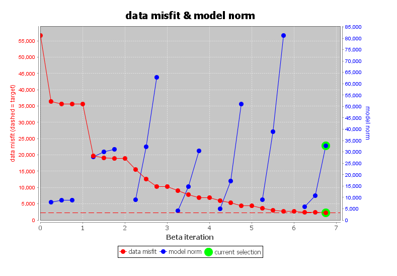
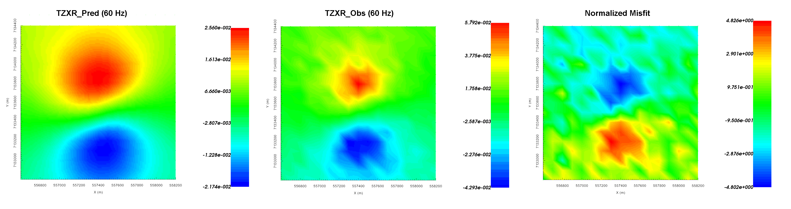

.. _AtoZNS_ztem_inversion:

.. include:: <isonum.txt>

Inverting MT Data
=================

Here, we invert synthetic ZTEM data using E3DMT versions 1 and 2.
The goal is to provide strategies for successful inversion and show that both codes can be used to recover the pipe.

.. _AtoZNS_inversion_setup:

Setup for the Exercise
----------------------

**If you have completed the tutorial** :ref:`"Importing, Interpreting and Preparing NSEM Data"<AtoZNS_data>`:

    - Open your pre-existing GIFtools project
    - :ref:`Set the working directory <projSetWorkDir>` (if you would like to change it)

**If you have NOT completed the previous tutorial and would like to start here, complete the following steps:**

    - Download the demo (**pending**)
    - Open GIFtools
    - :ref:`Set the working directory <projSetWorkDir>`
    - :ref:`Import the observed data in E3DMT version 1 format <importNSEMData_e3dmt1>`. The data file is *ZTEMdata_v1.obs* and is found in the *assets* sub-folder (ZTEM data are unitless)
    - :ref:`Load OcTree mesh <importMeshOctree>`. Found in the folder *assets/octree_model_ztem*.
    - :ref:`Load active cells model <importActiveModel>`. Found in the folder *assets/octree_model_ztem*.
    - :ref:`Load true model <importModel>`. Found in the folder *assets/octree_model_ztem*.

.. figure:: ../../../images/AtoZ_E3DMT/data_ztem.png
    :align: center
    :width: 700

    Z-axis tipper measurements at 60 Hz. It is important to note that the 'X' in TZXR data refers to the Northing direction! 'R' refers to real component and 'I' refers to imaginary component.

.. important:: Data were generated using E3DMT version 2 and a block model approximating TKC. To keep things simple, the synthetic model was given a constant topography of 400 m. Uncertainties of 0.001 :math:`\pm` 10% were added to all data.

E3DMT Version 1
---------------

Let us now invert the ZTEM data using E3DMT version 1. 

    - :ref:`Create E3DMT ver 1 inversion object <createMTZTEMInv>`
    - :ref:`Use edit options <invEditOptions_e3dmt_ver1>` to set the inversion parameters

        - Basic Tab:
            - Select the ZTEM data
            - Set mesh
            - Set topography to active cells model
            - No background susceptibility
            - 1D conductivity of 0.001 S/m
            - Use *Iterative* solver unless you have sufficient RAM to use *Direct* solver.

        - Model Options Tab:
            - Set *Beta cooling schedule* to 'custom by clicking button'. Use *beta max = 0.4*, *beta min = 1e-6* and *reduction factor = 0.2*
            - Set *Chi Factor* = 1.
            - *alpha S* = 0.0004, *alpha E* = 1, *alpha N* = 1 and *alpha Z* = 4 (to balance regularization terms based on cell dimensions)
            - Set the *active cells topo* as the active model cells
            - Set initial model as 0.001 S/m
            - Set upper bound as 0.5 S/m and lower bound as 0.00001 S/m
            - Set reference model as 0.001 S/m
            - Set role in model objective function to *SMOOTH_MOD_DIF*

    - Click *Apply and write files*
    - :ref:`Run the inversion <invRun>`
    - :ref:`Load results <invLoadResults>`
    - :ref:`View convergence <convergence_curve>`

The results of the inversion are shown below. The convergence curve indicated that the inversion reaches target misfit after 2 iterations. When comparing the true model and recovered model at iteration 2, we see that the inversion recovers the both the DO-27 and DO-18 kimberlite pipes. Surface weighting was able to limit near surface artifacts. However, the recovered model has a slightly lower conductivity than the true model. Given that the starting and reference models are a 0.0001 S/m halfspace, it is possible the uncertainties on the data are too large. When examining the normalized misfit, we see that locations over the pipes are not fit nearly as well as the background. Essentially, we are overfitting the background at the expense of the pipes. Although it is not shown here, we are not over-fitting the data at certain frequencies at the expense of others.

    Recovered model at iteration 4. EW cross-section (left), NS cross-section (centre), horizontal slice (right).

    True model. EW cross-section (left), NS cross-section (centre), horizontal slice (right).

    Convergence curve shows that inversion reaches target misfit. The model norm is discontinuous because the reference modeled is updated at each iteration.

    Predicted data (left), observed data (centre) and normalized misfit (right) for the real component of :math:`T_{zx}` at 60 Hz.

E3DMT Version 2
---------------

Let us now invert the ZTEM data using E3DMT version 2. Unlike version 1, version 2 requires that user define the receiver which measure the fields.

    - Click the impedance data object and :ref:`set receivers from locations <objectDataTypeMT_snid>`. Use the following values:

        - Easting width = 2 m
        - Northing width = 2 m
        - Vertical width = 2 m

    - :ref:`Create E3DMT ver 2 inversion object <createMTZTEMInv>`
    - :ref:`Use edit options <invEditOptions_e3dmt_ver1>` to set the inversion parameters

        - Basic Tab:
            - Select the impedance data
            - Set mesh
            - Set topography to active cells model
            - No background susceptibility
            - 1D conductivity of 0.001 S/m (which we inferred from apparent resistivity maps)
            - Use *Iterative* solver unless you have sufficient RAM to use *Direct* solver.

        - Model Options Tab:
            - Set *Beta cooling schedule* to 'custom by clicking button'. Use *beta max = 0.7*, *beta min = 1e-6* and *reduction factor = 0.2*
            - Set *Chi Factor* = 1.
            - *alpha S* = 0.0004, *alpha E* = 1, *alpha N* = 1 and *alpha Z* = 4 (to balance regularization terms based on cell dimensions)
            - Set the *active cells topo* as the active model cells
            - Set initial model as 0.001 S/m
            - Set upper bound as 0.5 S/m and lower bound as 0.00001 S/m
            - Set reference model as 0.001 S/m
            - Set role in model objective function to *SMOOTH_MOD_DIF*

    - Click *Apply and write files*
    - :ref:`Run the inversion <invRun>`
    - :ref:`Load results <invLoadResults>`
    - :ref:`View convergence <convergence_curve>`

The final model recovered using E3DMT version 2 is shown below. As we can see, the DO-27 and DO-18 kimerlite pipes are recovered. However when comparing the final recovered models from E3DMT versions 1 and 2, we notice they are slightly different. This can be explained by the following:

    1. The measure of data misfit for both codes is different; see `E3DMT manual <https://e3dmt.readthedocs.io/en/manual_ver1/content/theory.html#data-misfit>`__ . Thus the optimization problem being solved at each beta and the target misfit are both different; which results in recovered models which are not identical.
    2. Because receivers are explicitly defined in E3DMT version 2, there is a difference in how both codes compute predicted data from the solution of the fields on cell edges.

In this case, it is likely that the data uncertainties used to invert data with E3DMT version 2 were too high. The target misfit could be reached using a trade-off parameter (beta) that was larger than necessary and the data are being under-fit. The end result is a model that is overly smooth and has a maximum conductivity which is too low. The user could have run this inversion with a chi factor less than 1 to recover models which put increasing emphasis on fitting the data.

    Recovered model at iteration 4. EW cross-section (left), NS cross-section (centre), horizontal slice (right).

    True model. EW cross-section (left), NS cross-section (centre), horizontal slice (right).

    Convergence curve shows that inversion reaches target misfit. The model norm is discontinuous because the reference modeled is updated at each iteration.

    Predicted data (left), observed data (centre) and normalized misfit (right) for the real component of :math:`T_{zx}` at 60 Hz.