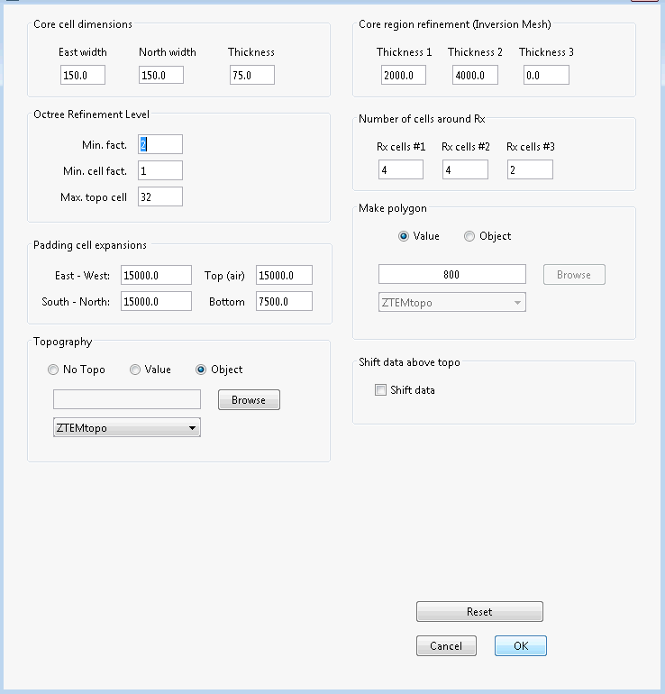

.. _comprehensive_workflow_ztem_5:

Mesh Design
===========

Here we a basic approach for mesh design when inverting ZTEM data. The field data provided was collected in a region with extreme topography. Here, we will show how to account for this during the mesh design step.

Skin Depth
^^^^^^^^^^

For frequency-domain data, an important step is to compute the minimum and maximum skin depth for the data you want to invert; e.g. the data sensitive to structures you would like to recover. The skin depth depends on frequency and the electrical resistivity/conductivity:

.. math::
	\delta \approx 500 \sqrt{\frac{\rho}{f}} = 500 \sqrt{\frac{1}{\sigma f}}

Unlike MT and FEM data, it is extremely challenging to estimate the background conductivity directly from ZTEM data. As result, physical property values estimated from lab measurements or other survey methods is very useful. As we will demonstrate in the :ref:`inversion step <comprehensive_workflow_ztem_6>` , failure to accurately estimate the background conductivity will impact the recovered model.

**Our Approach:**

For the tutorial example, no information about the background conductivity was provided. As a result, we assume a background conductivity of 0.001 S/m. We are inverting 5 frequencies between 30 Hz and 360 Hz. For these two frequencies, and for the background conductivity chosen:

	- :math:`\delta_{min}` = 833 m
	- :math:`\delta_{max}` = 2887 m

Create Mesh
^^^^^^^^^^^

Here, we explain how to create an OcTree mesh based on ZTEM survey geometry. We also explain the reasoning for the parameter values entered. We can create OcTree meshes from ZTEM surveys with the following utilities:

	- :ref:`create OcTree mesh with E3DMT utilities <createE3DMToctreeMesh>`
	- :ref:`create OcTree mesh with E3DMT v2 utilities <createE3DMTv2octreeMesh>`

Once you have created the object, complete the following steps:

	1) Set the data object corresponding to the survey
	2) Define the mesh using *Edit Options*
	3) Run the utility
	4) Load results

For the field data provided, we chose to create the mesh using E3DMT v2 utilities. This was done because we are able to define the receiver loops. The parameters set in *Edit Options* are shown below along with reasoning for several important choices. For definitions of the parameters, consult the `E3DMT <https://e3dmt.readthedocs.io/en/e3dmt/content/inputfiles/createOcTree.html>`__ or `E3DMT v2 <https://e3dmt.readthedocs.io/en/e3dmt_v2/content/inputfiles/createOcTree.html>`__ manual.

    Parameters used to define the mesh for the field dataset using E3DMT v2 mesh utility.

**Minimum cell width (horizontal):** A minimum horizontal cell width of 150 m was chosen based on a minimum data separation of 350 m. In practice, the user should have at least 2-3 cells between each data point. In general, the down-sampling and minimum horizontal cell width is dependent on the flight-line separation.

**Minimum cell width (vertical):** The minimum vertical cell width is determined primarily by the smallest skin depth. If the topography is flat and the geology is relatively simple, the minimum vertical cell width can be roughly 10%-20% the minimum skin depth. Because the source signal for natural source EM data is a vertically propagating plane-wave, it is sometimes more beneficial to discretize in the vertical more than in the horizontal; because lateral variations in the fields are smaller. For the dataset provided, a minimum vertical cell width of 75 m was chosen based on the minimum skin depth and the extreme topography of the region.

**Max. topo cell:** Although the topography is extreme in this case, we do not want to over-discretize in regions away from the survey, as the fields there do not greatly impact the data. As a result, this parameter was set to a larger number. If you want to more finely discretize the topography, set this to 4, or even 2. E3DMT v1 does not have this option.

**Padding cell expansions:** The extent of the mesh depends on the largest skin depth. The mesh should extend 2-3 largest skin depths from the survey region in all directions. Because OcTree meshes pad out so effectively, setting this to be very large does not add many additional cells.

**Core region discretization:** *Thickness 1 *should be used to discretize the region sensitive to the highest frequencies (2-3 smallest skin depths). *Thickness 2* and *3* should be used to discretize the additional regions sensitive to he lower frequencies. *Thickness 1 + Thickness 2 + Thickness 3* should be roughly equal to 2-3 times the largest skin depth.

**Number of cells around Rx:** The number of fine mesh cells near receivers does need to be as large for natural source EM modeling as is does for controlled source EM modeling, as the fields are much smoother. You can make the mesh a much more reasonable size by taking advantage of this however, sufficient discretization is required to model the fields accurately.

**Make polygon:** For UBC-GIF v2 codes, this parameter controls the horizontal extent of the core mesh region. In pratice, this should be 1-2 times the smallest skin depth.

**Shift data about topo:** We chose not to shift the data locations so that true flight height was preserved over discretized topography. If this is done, you will need to repeat the steps in the :ref:`data preparation section <comprehensive_workflow_ztem_4>` and import your uncertainties.
