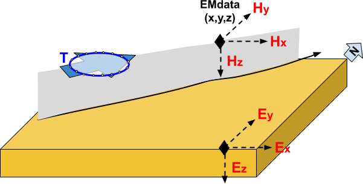
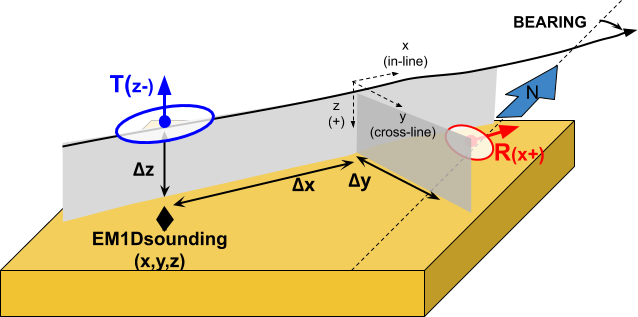
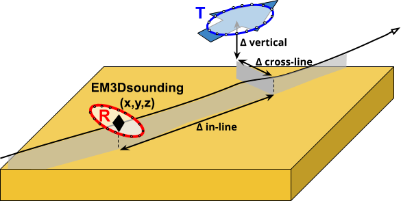

.. _objectEMdtype:

.. include:: <isonum.txt>

EM Data Classes
===============

There are two main types of EM data that can be created in GIFtools.

.. _objectEMdtype_FEMdata:

EMdata
^^^^^^

Data class used for:

-  `E3Dv1 <https://e3d.readthedocs.io/en/e3dinv/content/files/obsFile.html#observations-file>`_,
- ``H3DTD``
- ``TDoctree_v1``

The receivers are assumed to be point measurements of the fields (E, H) along
the Cartesian directions. Transmitters can be defined as

- **TRX_LOOP:** Simple loop
	- Radius of the transmitter
	- :math:`\theta` angle from vertical (0=planar loop)
	- :math:`\alpha` (azimuthal) angle from North
- **TRX_ORIG:** Defined by vertices
	- For purely inductive source, the first and last entry must be the same in order to close the wire path.

.. _objectEMdtype_FEMsounding:

EMsounding
^^^^^^^^^^

Both the transmitter and receiver locations are required and used in the forward and inverse problems. This is the most general format that allows to store raw data collected along line.

1Dsounding
----------

- `EM1DFM <https://em1dfm.readthedocs.io/en/latest/#em1dfm-package>`_,
- `EM1DTM <https://em1dtm.readthedocs.io/en/latest/#em1dtm-package>`_

For `EM1Dsounding` objects, the position of the receiver is set **relative to the transmitter locations**. The following parameters are required:

	- **Along-line offset:** The along-line position of receivers, **relative to transmitter locations**
	- **Cross-line offset:** The cross-line position of receivers, **relative to transmitter locations**
	- **Vertical offset:** The vertical location of the receivers relative to the surface

.. _objectEMdtype_FEM3Dsounding:

3Dsounding
----------

This data class is use for:

- `E3Dv2 tiled <https://e3d.readthedocs.io/en/e3dinv_ver2_tiled/index.html#e3d-version-2-tiled-package>`_
- ``TDoctreev2 tiled``

For `EM3Dsounding` objects, information about the position and orientation of the system are stored directly by the transmitter and receiver objects.

