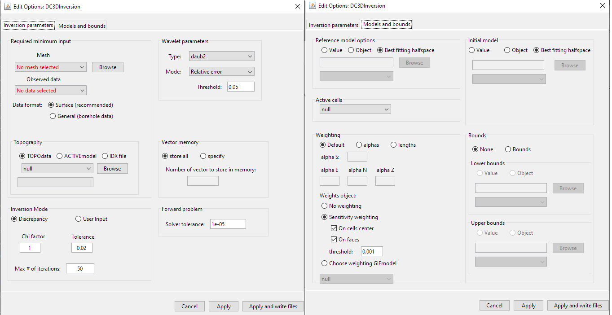
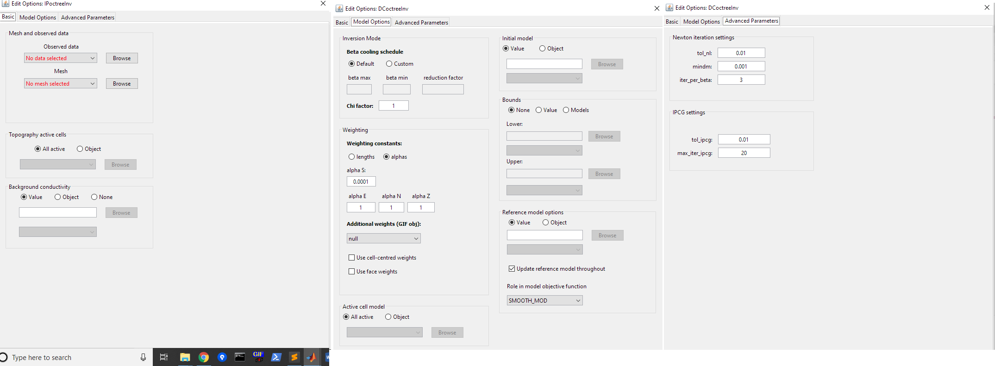

.. _invEditOptions_dcip:

.. include:: <isonum.txt>

Edit Options for DCIP Inversion Objects
***************************************

.. _invEditOptions_dcip2d:

DCIP2D
======

This functionality is responsible for setting all inversion parameters pertaining to the "DC2Dinversion" and "IP2Dinversion" codes; see `DCIP2D online manual <http://dcip2d.readthedocs.io/en/latest/index.html>`__ . The edit options window is comprised of 2 tabs:

    - **Basic:** Sets minimum required input for the inversion

    - **Advanced:** Sets advanced parameters for the inversion, including: the solver, regularization, weights and hard constraints

.. figure:: ../images/dcip2d.png
    :align: center
    :width: 700

    Basic (left), advanced parameters 1 (middle) and advanced parameters 2 (right) tabs.

Units
-----

**Inputs:**

	- **Observed DC data:** observed voltage, normalized by the transmitter current (i.e. :math:`\Delta V/ \! I` )
	- **Observed IP data:** apparent intrinsic chargeabilities (i.e. :math:`\eta_a \in [0,1]`)
	- **Reference/background conductivity model:** S/m
	- **Reference chargeability model:** intrinsic chargeabilities (i.e. :math:`\eta_a \in [0,1]`)

**Outputs:**

	- **Recovered conductivity model:** S/m
	- **Recovered chargeability model:** intrinsic chargeabilities (i.e. :math:`\eta \in [0,1]`)

Basic
-----

	- **Mesh:** mesh for the recovered model

		- **Default (DC only):** The cell size, core region and padding are set automatically based on the electrode spacings and locations. This option will output a mesh object.
		- **Semi-default (DC only):** The user specifies the minimum number of cells between electrodes (*default* = 4) and the aspect ratio (*default* = 2). The aspect ratio is the vertical dimensions of the cells divided by the horizontal width. This options will output a mesh object.
		- **Object:** a mesh object is provided. Reference models, starting models and bound models must all exist on this mesh. For IP inversion, the mesh from the DC inversion must be used.

	- **Observed data:**

		- For DC inversion, the data are the observed voltage, normalized by the transmitter current (i.e. :math:`\Delta V/ \! I` ).
		- For IP inversion, the data are the apparent intrinsic chargeabilities where :math:`\eta_a \in [0,1]`.
		- Data format:
			- **Surface Data Format (recommended)**: Use this data format if the electrodes are at the surface. The Z-values will be excluded from the output data file and the forward modeling code will take care of projecting them at the surface. This avoid the risk of having electrodes in the air or underground.
			- **General Data Format**: Use this option if any electrode is underground. The Z-values are specified in the output data file.

	- **Topography:**

	    - *Default:* Sets topography assuming all electrode are located on the Earth's surface
	    - *Value:* Set the surface to the specified elevation value
	    - *Object:* A 2D topography data object

	- **Conductivity Model (IP inversion only):** Constant value or conductivity model object. Reference and starting models are set in the advanced parameters tab.

Advanced (Parameter 1)
----------------------

**Trade-off parameter:** The inversion choses the optimum trade-off parameter based on the :ref:`chi factor <Fundamentals_Beta_Discrepancy>`.

	- **Chi factor**: sets the target data misfit for the inversion (*default* = 1). :math:`target = C.F. \times \# \, data`.
	- **Max number of iterations:** maximum number of iterations to find optimum trade-off parameter (*default* = 50).

**Inverse solver:** Sets the solver used to determine the model update direction.

	- **SVD:** Singular value decomposition
	- **CG:** Conjugate gradient solver. The user may specify the number of conjugate gradient iterations (*default* = 10) and the accuracy of the solve (*default* = 0.01).

**Length scales:** Sets the weights for smallness and smoothness regularization in x and z; for relevant equations `see manual <http://dcip2d.readthedocs.io/en/latest/content/backgroundtheory.html#equation-intMOF>`__ .

	- **Default:** Sets the values of *alpha S*, *alpha X* and *alpha Z* based on cell dimensions
	- **Alphas:** Sets specific values for *alpha S*, *alpha X* and *alpha Z*
	- **Lengths:** User sets values *Len E* and *Len Z* which define the values of *alpha X* and *alpha Z* relative to *alpha S*. These relationships are given by :math:`L_x = \sqrt{\frac{\alpha_x}{\alpha_s}}` and :math:`L_z = \sqrt{\frac{\alpha_z}{\alpha_s}}`.

**Bounds:** Here, the user specified the lower and upper bounds for the inverted physical property values. For both lower and upper bounds, the user may choose from the following options:

	- **None:** No bounds
	- **Value:** A constant value applied to all cells
	- **Object:** A model object containing a distinct bound value for every cell

**Output files:** Here, the user controls the number of output files. They may choose to output every iteration of the inversion or just the final result

**Wave:** To solve the 2D forward problem, the problem must be solved in the wave domain. *N* specifies the number of log-distribution waves numbers used between *Min* and *Max*. The default is set to: *N* = 13, *Min* = 2.5e-4 and *Max* = 1.

**Huber norm:** Here, the user specifies the norm for the data misfit. For description of the data misfit see the `DCIP2D manual <http://dcip2d.readthedocs.io/en/latest/content/backgroundtheory.html#equation-phid>`__ .

	- **Default data misfit:** the data misfit is defined by an :math:`L_2 \!` -norm
	- **Huber norm:** the data misfit is defined by the Huber norm and the user may specify the Huber constant (:math:`c`).

Advanced (Parameter 2)
----------------------

**Model objective function norm:** Here, the user specifies the norm for the smallness and smoothness in X and Z. Background information regarding the model objective function norm and relevant parameters can be found within the `DCIP2D manual <http://dcip2d.readthedocs.io/en/latest/content/backgroundtheory.html#equation-intMOF>`__

	- **Default norm:** an :math:`L_2 \!`-norm is used for the smallness and smoothness terms
	- **Ekblom norm (CG solver only):** The Ekblom norm can be used to recover more compact and blockier models. For each term in the model objective function, the user specifies the parameters :math:`\epsilon` and :math:`\rho`.

**Reference model:** Here, the user specifies the reference model used in the inversion. There are 3 choices:

	- **Default:** no reference model is used
	- **Value:** a constant reference model is used
	- **Object:** the user specifies a model object as the reference model

**Role in the model objective function:** Here, the user chooses from the following 2 options in the case a reference model is used:

	- **SMALLEST MODEL ONLY:** The reference model is only used in the smallness term. The inversion attempts to preserve the structures found in the reference model.
	- **ALL DERIVATIVES:** The reference model is used in the smallness and smoothness terms. The inversion attempts to preserve the structures and gradients found the in the reference model.

**Initial model:** The user specifies the starting model. There are 3 choices:

	- **Default:** the best-fitting half spaced is used as a starting model
	- **Value:** a constant reference model is used
	- **Object:** the user specifies a model object as the reference model

.. _invDCIP3DCreateSensWeights:

**Weighting functions:** Here, the user may choose not to include additional model weights (**none**) or include face/model weights using a weights object or sensitivity-based weighting. (see section :ref:`Import sensitivity as weights <importSensWeights>`).
	- **no weighting**: no weight is applied
	- **Sensitivity weighting**: If this latest option is chosen, the program will be called a first time to compute the sensitivity matrix. GIFtools will then automatically load the sensitivity, compute the weight and launch the full inversion.
		- On cells center: the sensitivity weights are applied to the smallness term
		- On faces: the sensitivity weights are applied on the gradient terms.
		- threshold: apply a threshold to the sensitivity weights
	- **Choose weighting GIFmodel**: select a GIFmodel to use as weights

**DCinversion** |rarr| **Discrete Topo/Weights** |rarr| **Create Sensitivity Weights**

.. math::
	\mathbf{w_s} = \mathbf{J}_{approx} / max(\mathbf{J}_{approx}) + \delta

.. math::
	\mathbf{w_x} = \mathbf{A}_c^{f_x}\mathbf{w_s}

.. math::
	\mathbf{w_y} = \mathbf{A}_c^{f_y}\mathbf{w_s}

.. math::
	\mathbf{w_z} = \mathbf{A}_c^{f_z}\mathbf{w_s}

where :math:`\mathbf{w_s}`, :math:`\mathbf{w_s}`, :math:`\mathbf{w_s}` and
:math:`\mathbf{w_s}` are the cell-center and cell-face weights,
:math:`\mathbf{J}_{approx}` are the values from the ``sensitivity.txt`` file,
values from :math:`\delta` is a user-defined threhold parameter ([DEFAULT=1e-2]) and :math:`\mathbf{A}_c^{f_x}, \mathbf{A}_c^{f_y},
\mathbf{A}_c^{f_z}` are averaging operators taking the cell-center values to the respective faces.

**Active cells:** If all cells are updated during the inversion, set as **null**. If an active cells model is supplied, only the cells which are set as active will be updated during the inversion. The values of the remaining cells are determined by the starting model.

.. _invEditOptions_dcip3d:

DCIP3D
======

    Basic (left), model and bounds (right) tabs.

Functionality specific to the ``DCIPinversion`` object

Discrete topo/weights -> Create Files (make_wdat)
-------------------------------------------------

.. figure:: ../../../../images/Inputs_make_wdat.png
    :align: center
    :width: 350

``MAKE_WDAT`` is a utility used to make a ``w.dat`` file that has smoothing in the x- and y-directions for the first few layers that underlie the topography surface. It suppresses the tendency of the algorithm to make highly variable structure in these top layers of the model (:ref:`link to the dcip3d manual <https://dcip3d.readthedocs.io/en/latest/content/runprog/weights.html>`).

.. note::
	We stress that the above weighting should be applied with care. A strong horizontal smoothing can often eliminate horizontal changes in the conductivity, even if the earth model truly had these. The inclusion, and details, of the surface weighting therefore involves subjective decision by the u er. Without weighting, the model at the surface can be quite rough (due to electrod effects). On the other hand, local geology is also sometimes quite rough and hence the tr e earth model should exhibit a large heterogeneity.

mesh
	The 3D mesh file used in the DC or IP inversion
topo
	A topography file that is in the general format. Use null to apply to the top layers of the mesh.

Layer
	Specify he number of layers to implement the weighting. The air layers will not be weighted and the remaining portion of the model will have a weight of 1.

weights
	Values of weights for the n layers specified on the previous line.

The program ``MAKE_WDAT`` outputs two files:

w.dat
	A 3D weighting file to use in the inversion

topo.idx (is ``Create File`` is selected)
	The topography file in discrete format named from the last line in the input file. This file is not generated if the name line in the input file was null.

.. _invDCIP3DInputOptions:

Discrete topo/weights -> Set for Inversion
------------------------------------------

.. figure:: ../../../../images/set_for_inversion.png
    :align: center
    :width: 350

Set the weights created with ``make_wdat`` in the inversion.

Discrete topo/weights -> create Sensitivity weights
---------------------------------------------------

Create a weighting files from a ``GIFmodel`` file (preferentially created from a ``sensitivity.txt`` file)

.. _invEditOptions_dcipoctree:

DCIP Octree
===========

    Basic (left), model options (middle) and advanced parameters  (right) tabs.

